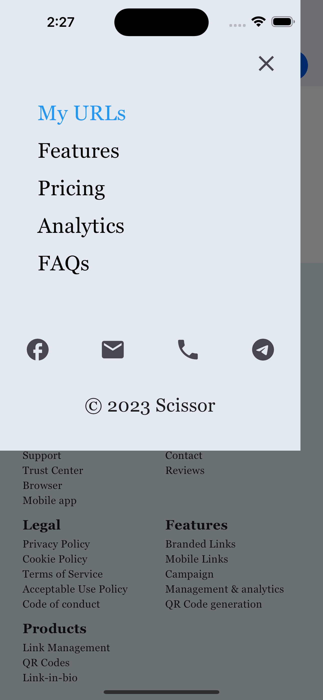

# scissor
Built with Flutter.

Features:
1. Efficient Link Shortening: Transform lengthy URLs into short and manageable links without compromising their functionality.

2. Customizable Links: Personalize your shortened URLs by adding custom aliases or keywords that reflect your brand or content.

3. Link Analytics: Gain valuable insights into your link performance with detailed analytics, including click-through rates, geographical data, and more.

Design: https://www.figma.com/file/vRyjmY0LFZCaN7Zn4ACEiL/SOE%3A-Scissor-Solution?type=design&node-id=103-179&t=gFcxsKylxlC5k4vI-0

## Screens
  | Header |     Features |    
:-------------:| :-------------:
 |  

| Drawer |    
:-------------:
 

 | Pricing |     Pricing |    
:-------------: |:-------------:
 |  

| Trim URL section |    
:-------------:
 

| FAQs section |    
:-------------:
 

| Footer |    
:-------------:
 

